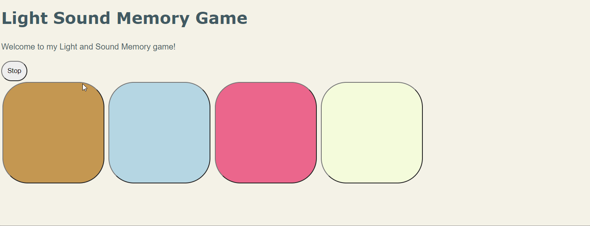

# Pre-work - *Memory Game*

**Memory Game** is a Light & Sound Memory game to apply for CodePath's SITE Program. 

Submitted by: **Stephane Mbenga**

Time spent: **5** hours spent in total

Link to project: (https://highfalutin-ebony-skateboard.glitch.me/)

## Required Functionality

The following **required** functionality is complete:

* [x] Game interface has a heading (h1 tag), a line of body text (p tag), and four buttons that match the demo app
* [x] "Start" button toggles between "Start" and "Stop" when clicked. 
* [x] Game buttons each light up and play a sound when clicked. 
* [x] Computer plays back sequence of clues including sound and visual cue for each button
* [x] Play progresses to the next turn (the user gets the next step in the pattern) after a correct guess. 
* [x] User wins the game after guessing a complete pattern
* [x] User loses the game after an incorrect guess

The following **optional** features are implemented:

* [x] Any HTML page elements (including game buttons) has been styled differently than in the tutorial
* [x] Buttons use a pitch (frequency) other than the ones in the tutorial
* [ ] More than 4 functional game buttons
* [ ] Playback speeds up on each turn
* [x] Computer picks a different pattern each time the game is played
* [x] Player only loses after 3 mistakes (instead of on the first mistake)
* [ ] Game button appearance change goes beyond color (e.g. add an image)
* [ ] Game button sound is more complex than a single tone (e.g. an audio file, a chord, a sequence of multiple tones)
* [ ] User has a limited amount of time to enter their guess on each turn

The following **additional** features are implemented:

- [ ] List anything else that you can get done to improve the app!

## Video Walkthrough (GIF)

If you recorded multiple GIFs for all the implemented features, you can add them here:
![] 
 
![] 

## Reflection Questions
1. If you used any outside resources to help complete your submission (websites, books, people, etc) list them here. 
    1. https://www.w3schools.com/jsref/jsref_random.asp: Referenced when creating feature such that a new pattern is created for every new game.

2. What was a challenge you encountered in creating this submission (be specific)? How did you overcome it? (recommended 200 - 400 words) 
 
 [A challenge I encountered while creating the game was delt with implementing the guess function.
 I was confused on how to determine when a turn is over, and how to translate it into a conditional statement.
 Rereading the role of the global variables I found that the progress variable kept track of what turn were, 
 and that the guess counter kept track of the number of guesses made during a turn. Another way to describe the 
 progress variable was that it stored the position of the last clue, in the patterns array, to be played on a turn. 
 I discovered that if the guess counter was equal to this then the turn ended. Knowing this also helped to me to 
 figure out when a round of the game was over.] 

3. What questions about web development do you have after completing your submission? (recommended 100 - 300 words) 

[After creating this project, I wondered how some websites can host hundreds of browser games to thousands of users while being able to save their progress in certain games. How much storage or space is required to maintain such websites. Does the storage change over time, or is it a set value. Do 
all the games use the same programming language, or are they different. How would a website be able to host games that are
written in different programming languages.] 

4. If you had a few more hours to work on this project, what would you spend them doing (for example: refactoring certain functions, adding additional features, etc). Be specific. (recommended 100 - 300 words) 

[If I had more time to work on this project, I would implement a two-player game mode, where two players are given two different sequences and the player that correctly plays all the sequences wins. First 1 player would go with the number of mistakes he/she made recorded at the end, and we repeat the same for the 2nd player. At the end we compare the number of mistakes each player made and choose the winner.  If both players both made no mistakes, then it is a draw.  To keep things fair both players would have the same game settings, meaning when a sequence is being played back, the time each clue is played, and the time between each clue to be played would be the same. In terms of the page, I would also add a two-player game mode button and a single player mode button to the page using html and hide one of them based on which mode was selected. Another game mode I would add would be a NonStop mode, where there’s no end to the game until the user makes a mistake. The user simply tries to play back the sequences given to him for as long as he/she can. The logic of this game mode could involve appending new clues to the end of the patterns array as the game runs. Along with this mode I would include a leaderboard which displays players across the world with the longest time played in the NonStop mode. Another feature I would add is giving users the chance to show of their wins to social media platforms.]

## Interview Recording URL Link

[My 5-minute Interview Recording](https://youtu.be/bRPmfKEKdbY)

## License

    Copyright [Stephane Mbenga]

    Licensed under the Apache License, Version 2.0 (the "License");
    you may not use this file except in compliance with the License.
    You may obtain a copy of the License at

        http://www.apache.org/licenses/LICENSE-2.0

    Unless required by applicable law or agreed to in writing, software
    distributed under the License is distributed on an "AS IS" BASIS,
    WITHOUT WARRANTIES OR CONDITIONS OF ANY KIND, either express or implied.
    See the License for the specific language governing permissions and
    limitations under the License.
