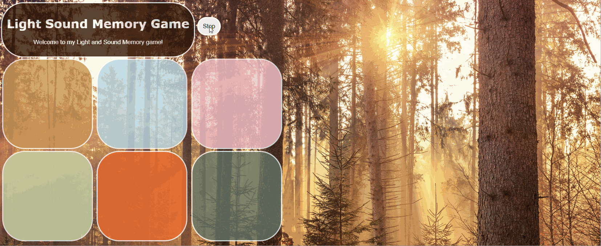

# *Light Sound Memory Game*

**Memory Game** is a Light & Sound Memory game I created using plain HTML, CSS, and JavaScript to apply for 2022 CodePath's SITE Program and Salesforce FTL program. 

## Video Walkthrough (GIF)

![] 
![] 
![] 

## License

    Copyright [Stephane Yannick Christopher Mbenga]

    Licensed under the Apache License, Version 2.0 (the "License");
    you may not use this file except in compliance with the License.
    You may obtain a copy of the License at

        http://www.apache.org/licenses/LICENSE-2.0

    Unless required by applicable law or agreed to in writing, software
    distributed under the License is distributed on an "AS IS" BASIS,
    WITHOUT WARRANTIES OR CONDITIONS OF ANY KIND, either express or implied.
    See the License for the specific language governing permissions and
    limitations under the License.
